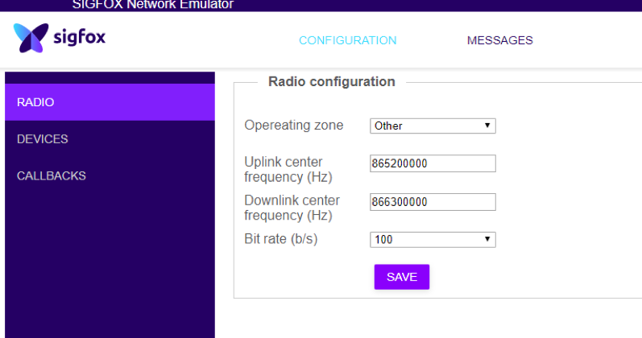
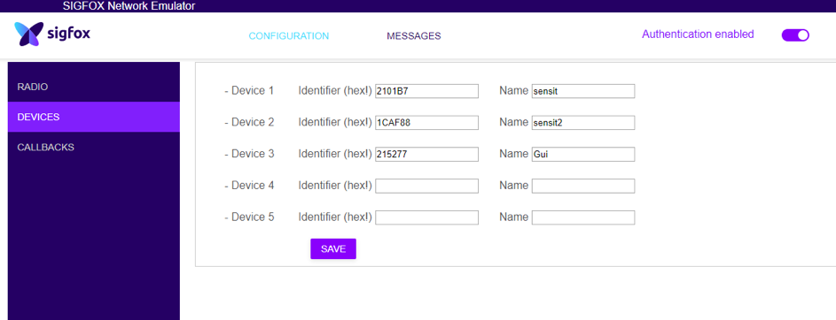
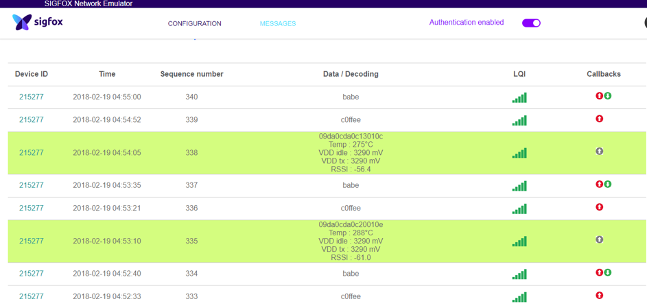

# Use the Sigfox Network Emulator with India Configuration

The Sigfox network in India will use a dedicated radio configuration, called [RC6](https://build.sigfox.com/sigfox-certification-tests/#sigfox-rf-and-protocol-rc6-documents).
This configuration is very similar to the RC1, used in Europe, Middle East and Africa. The main difference is that the central frequency is at 865MHz instead of 868MHz.

This tutorial will show you how to configure a RC1 development kit (here, a [Unashield](https://unabiz.github.io/unashield/) and use it in RC6 configuration in India.

Thanks to **Ajay Nair**, a Sigfox team member in India, who wrote this tutorial!

## Setup

You need 
* 1 [SDR Dongle](https://build.sigfox.com/sdr-dongle). This USB key comes with a dedicated _Sigfox Network Emulator_ softwaren allowing to locally emulate the Sigfix network
* 1 Arduino Uno board
* 1 Sigfox shield with a Wisol RC1 module, could be 
  * 1 [Unabiz Arduino shield](https://www.unabiz.com/portfolio/unashield/)
  * 1 [Wisol breakout](https://yadom.eu/kit-de-developpement-sigfox-sdr-dongle-brkws01.html) from Yadom

The test can be done with either
* Over the air, using an antenna on both the SDR dongle and the shield. Please note that this emulator is intended for close-range testing (a few meters), not to reflect the long distance communications of the live service
* In conducted mode, with a SMA cable and an attenuator which are included in the SDR Dongle package

## SDR Dongle configuration

To work under RC6 specifications the SDR dongle software must be configured like this: 

### Radio frequencies

Set the Uplink center frequency at `865200000`Hz, Downlink center frequency at `866300000`Hz and bit rate at `bits/second`

### Devices whitelist

The Network Emulator software will only process Sigfox messages coming from a whitelist of devices.

Extract the ID of your own device, and set it in the Devices menu as in this example:

### Callbacks

You can use the callbacks menu to configure [a Sigfox callback](https://support.sigfox.com/docs/callbacks-documentation) to push incoming data to your own application server.

## Arduino code for your Unashield

Upload the [sample Arduino code](./hello-india.ino) to your Arduino board.

This sample code will do the following :

* Set up the proper central frequencies and emulator mode, using the module documented [AT commands](./medias/wisolcommandat_wssfm10r.pdf)
  * `AT$IF=865200000` — Uplink central frequency
  * `AT$DR=866300000` — Downlink central frequency
  * `ATS410=1` — Mode _public key_ on
  * `ATS302=15`  — Set output power to max value
  * `AT$WR` — Save configuration
* Send hardcoded messages. Check the code 🧐

## Received messages

In the messages panel (example below), you will see :

* Incoming _uplink_ messages, with payload `0xC0FFEE`
* Incoming _downlink_ messages, with payload `0xBABE`
  * _Downlink_ means that the device request a reply, and will wake up after a few seconds to receive it
  * You will see an _Out of Band_ message, which is the _ACK_ sent by the device (including voltage & received signal strength information) after receiving the downlink response

